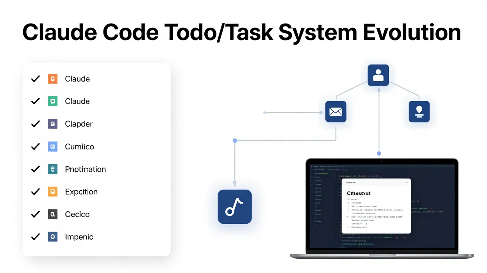

# Claude Code Todo/Task System Evolution: A Technical Deep-Dive



## Introduction: The Task Management Challenge

Building AI-powered coding assistants presents a unique challenge: how do you help users track and manage complex, multi-step workflows when the AI itself is generating and executing code? Claude Code's evolution from a simple `TodoWrite` tool to a sophisticated multi-tool task management system reflects years of iteration on this fundamental problem.

This article provides a technical deep-dive into that evolution, examining the architecture decisions, implementation details, and lessons learned along the way. Whether you're building integrations for Claude Code or simply want to understand how its task management works under the hood, this guide will give you the comprehensive technical context you need.

---

## The Origin: TodoWrite and Its Limitations

### What TodoWrite Was Designed For

When Claude Code first introduced the `TodoWrite` tool, the goal was simple: provide agents with a way to create and track task lists that users could see and understand. The tool accepted an array of task objects, each containing:

- **content**: The task description
- **status**: One of `pending`, `in_progress`, or `completed`
- **activeForm**: A description of the current activity (for in-progress tasks)

```typescript
interface TodoWriteInput {
  todos: Array<{
    content: string;
    status: "pending" | "in_progress" | "completed";
    activeForm?: string; // Optional, only used when status is 'in_progress'
  }>;
}
```

This simple model worked well for straightforward workflows. An agent could create a todo list, update tasks as it progressed, and users would see a clear representation of what was being done.

### The Limitations Emerged

However, as Claude Code usage grew, users began pushing the system into more complex scenarios:

**1. No Dependency Tracking**: If Task B required Task A to complete first, TodoWrite had no way to express or enforce this. The system treated all tasks as independent items.

**2. Single-Tool Bottleneck**: Every operation—creating, updating, viewing—went through the same `TodoWrite` call. This made it impossible to build efficient UIs that could query task state without triggering a full update.

**3. Limited Persistence**: Task state was tied to the conversation session. Resuming after a disconnect meant reconstructing the todo list from context, not from a persistent store.

**4. No Task Identity**: Tasks had no persistent IDs. Deleting or modifying a task required matching by content, which broke when content changed during the workflow.

---

## The Evolution: v2.1.16 and the New Task System

### Introducing the Multi-Tool Architecture

In January 2025, Claude Code v2.1.16 marked a significant milestone: the introduction of a proper task management system built on multiple dedicated tools. This wasn't just an upgrade—it was a fundamental architectural shift.

The new system introduced three core tools:

| Tool         | Purpose                                             |
| ------------ | --------------------------------------------------- |
| `TaskList`   | View all active tasks in the current session        |
| `TaskGet`    | Retrieve detailed information about a specific task |
| `TaskUpdate` | Update task status, metadata, or delete tasks       |

This separation of concerns enabled several important capabilities:

1. **Efficient Queries**: UIs could poll `TaskList` without triggering updates
2. **Granular Operations**: Update a single field without touching the entire list
3. **Persistent Identity**: Each task got a unique, persistent ID

### The v2.1.16 Release

The initial v2.1.16 release focused on establishing the new architecture. Tasks now supported:

- **Unique Task IDs**: Persistent identifiers that survived across sessions
- **Dependency References**: Tasks could reference other tasks by ID
- **Rich Metadata**: Timestamps, owner information, and custom fields

```typescript
interface Task {
  id: string;
  content: string;
  status: "pending" | "in_progress" | "completed";
  activeForm?: string;
  dependencies?: string[]; // New in v2.1.16
  metadata?: Record<string, unknown>;
  createdAt: string;
  updatedAt: string;
}
```

### v2.1.19: The Configuration Fallback

By late January 2025, v2.1.19 introduced a configuration option for users who preferred the old system:

```bash
CLAUDE_CODE_ENABLE_TASKS=false
```

This allowed organizations with existing integrations to maintain backward compatibility while the new system stabilized. It also provided a safety valve if bugs in the new system caused issues in production environments.

### v2.1.20: Stability and Feature Completeness

The v2.1.20 release addressed several critical bugs and added long-awaited features:

**Bugs Fixed**:

- Session compaction no longer caused full history reload
- Task list rendering was corrected to stay within conversation bounds
- Agent message handling was fixed to prevent race conditions

**New Features**:

- **Task Deletion**: `TaskUpdate` now supported deletion operations
- **Dynamic Terminal Height**: `TaskList` adjusted display based on terminal size
- **Improved Error Messages**: More actionable feedback for common issues

### v2.1.21: The Final Piece

v2.1.21 addressed a subtle but critical bug: task ID reuse after deletion. When a task was deleted, its ID could potentially be reassigned to a new task, causing confusion in systems that cached task references. The fix ensured ID uniqueness even after deletion cycles.

---

## New Architecture: Deep Dive into the Tools

### TaskList: Viewing Active Tasks

The `TaskList` tool provides a snapshot of all active tasks in the current session:

```typescript
// Input (empty for current session)
interface TaskListInput {}

// Output
interface TaskListOutput {
  tasks: Array<{
    id: string;
    content: string;
    status: "pending" | "in_progress" | "completed";
    activeForm?: string;
    dependencies?: string[];
  }>;
  stats: {
    total: number;
    pending: number;
    in_progress: number;
    completed: number;
  };
}
```

**Key Behaviors**:

- Returns only active (non-deleted) tasks
- Sorted by creation order by default
- Terminal height affects how many tasks are displayed at once

### TaskGet: Retrieving Task Details

`TaskGet` fetches complete information about a single task:

```typescript
interface TaskGetInput {
  taskId: string;
}

interface TaskGetOutput {
  task: {
    id: string;
    content: string;
    status: "pending" | "in_progress" | "completed";
    activeForm?: string;
    dependencies?: string[];
    metadata?: Record<string, unknown>;
    createdAt: string;
    updatedAt: string;
  };
}
```

**Use Cases**:

- Fetching task details before updating
- Checking if a task still exists before referencing it
- Retrieving metadata for custom processing

### TaskUpdate: Modifying Tasks

`TaskUpdate` is the workhorse of the system, supporting multiple operations:

```typescript
interface TaskUpdateInput {
  taskId: string;
  status?: "pending" | "in_progress" | "completed";
  activeForm?: string;
  content?: string; // New content
  delete?: boolean; // Delete the task (v2.1.20+)
  metadata?: Record<string, unknown>;
}

interface TaskUpdateOutput {
  success: boolean;
  task?: Task; // Updated task, if not deleted
}
```

**Operation Modes**:

1. **Status Update**: Change task state
2. **Content Update**: Modify task description
3. **Metadata Update**: Add or update custom fields
4. **Deletion**: Remove task entirely

---

## Dependency Tracking: Enabling Complex Workflows

One of the most significant additions in v2.1.16 was dependency tracking. This feature allows tasks to reference other tasks, enabling:

### Expressing Task Relationships

```typescript
// Creating a task with dependencies
await TaskUpdate({
  taskId: "task-123",
  dependencies: ["task-122", "task-121"], // These must complete first
});
```

### Dependency-Based Execution

Agents can use dependencies to ensure proper execution order:

1. **Validation**: Before starting Task B, verify Task A is completed
2. **Visualization**: Show task relationships in UIs
3. **Auto-Advancement**: When a dependency completes, automatically start dependent tasks

### Best Practices for Dependencies

```typescript
// Good: Express clear dependencies
const setupDb = await TaskUpdate({
  taskId: "setup-db",
  content: "Set up database schema",
});

const seedData = await TaskUpdate({
  taskId: "seed-data",
  content: "Seed initial data",
  dependencies: [setupDb.id], // Clear dependency relationship
});

// Bad: Circular or missing dependencies
const taskA = await TaskUpdate({
  /* ... */
});
const taskB = await TaskUpdate({
  dependencies: [taskA.id],
  // Missing: taskA depends on taskB?
});
```

---

## TodoWrite vs. New Task System: A Comparison

When deciding how to integrate with Claude Code's task management, understanding the differences between the original `TodoWrite` approach and the new dedicated tools is essential. The following comparison highlights key similarities, differences, and trade-offs.

### Feature Comparison Matrix

| Feature                    | TodoWrite                        | TaskList/TaskGet/TaskUpdate         |
| -------------------------- | -------------------------------- | ----------------------------------- |
| **Task Creation**          | Bulk creation via array          | Single task creation via TaskUpdate |
| **Task Reading**           | Returns full list on every write | Granular reads via TaskList/TaskGet |
| **Task Updates**           | Replace entire list              | Field-level updates via TaskUpdate  |
| **Task Deletion**          | Filter out from list             | Explicit delete via TaskUpdate      |
| **Unique Task IDs**        | No (content-based matching)      | Yes (persistent UUIDs)              |
| **Dependency Tracking**    | No                               | Yes (dependency arrays)             |
| **Metadata Support**       | No                               | Yes (custom metadata fields)        |
| **Persistence**            | Session-bound                    | Persistent across sessions          |
| **Performance**            | Full list sync each time         | Efficient incremental updates       |
| **Complexity**             | Simple, single-tool              | Multi-tool, more complex            |
| **Backward Compatibility** | N/A (original system)            | Supports fallback via config        |

### Pros and Cons Summary

#### TodoWrite

**Pros:**

- **Simplicity**: Single tool handles all operations
- **Familiarity**: Well-documented, widely used
- **Automatic Sync**: Changes immediately reflected in UI
- **Lower Learning Curve**: Easy to get started

**Cons:**

- **No Unique IDs**: Tasks identified by content, not stable identifiers
- **No Dependencies**: Cannot express task relationships
- **Full List Overhead**: Must handle entire list for any change
- **Session-Bound**: State lost when session ends
- **Limited Metadata**: No way to attach custom data

#### New Task Tools (TaskList/TaskGet/TaskUpdate)

**Pros:**

- **Stable Identifiers**: Persistent IDs enable reliable references
- **Dependency Management**: Express and enforce task relationships
- **Efficient Queries**: Read single tasks without full list
- **Rich Metadata**: Attach custom fields to tasks
- **Persistence**: State survives session boundaries
- **Granular Updates**: Modify single fields without list replacement

**Cons:**

- **Multi-Tool Complexity**: Requires managing multiple tools
- **Learning Curve**: More concepts to understand
- **Explicit State Management**: Must handle ID tracking yourself
- **Potential Sync Issues**: Must keep tools synchronized manually

### When to Use Each

| Use Case                                | Recommended Approach          |
| --------------------------------------- | ----------------------------- |
| Simple agent workflows with few tasks   | TodoWrite (simplicity)        |
| Building complex multi-step workflows   | New tools (dependencies)      |
| External tools needing task state       | New tools (direct access)     |
| Quick prototypes and experiments        | TodoWrite (fast to implement) |
| Production integrations with versioning | New tools (stability)         |
| Cross-session task persistence          | New tools (required)          |
| Task relationship visualization         | New tools (dependencies)      |

### Migration Considerations

If you're currently using TodoWrite and considering the new tools:

1. **Complexity vs. Capability**: New tools offer more power but require more code
2. **Incremental Migration**: You can use both systems simultaneously during transition
3. **ID Management**: Plan how you'll track task IDs across operations
4. **Error Handling**: Each tool has distinct error conditions
5. **Testing**: New systems require more comprehensive test coverage

The right choice depends on your specific requirements. For simple use cases, TodoWrite remains a valid choice. For complex workflows requiring dependencies and persistence, the new tools provide necessary capabilities.

---

## Integration Patterns: How External Tools Sync

### The TodoWrite Synchronization Layer

The original `TodoWrite` tool wasn't deprecated—it was repurposed as a synchronization layer. When an external tool calls `TodoWrite`, Claude Code translates this to the appropriate new tool calls:

```typescript
// External tool calls TodoWrite
await TodoWrite({
  todos: [
    { content: "Task A", status: "pending", activeForm: "Working on Task A" },
  ],
});

// Claude Code internally:
// 1. Calls TaskList to get current state
// 2. Compares with requested state
// 3. Creates/updates/deletes tasks via TaskUpdate
// 4. Returns synchronized result
```

### The rd2:tasks Integration

The rd2:tasks agent skill demonstrates proper integration:

```typescript
// rd2:tasks uses TodoWrite as synchronization point
async function syncTasks(tasks: Task[]) {
  await TodoWrite({
    todos: tasks.map((t) => ({
      content: t.content,
      status: t.status,
      activeForm: t.activeForm,
    })),
  });
}

// But rd2:tasks maintains its own task files:
// - docs/prompts/{WBS}_{topic}.md
// - Can operate independently of Claude Code session
```

### Building Your Own Integration

For tools that need to integrate with Claude Code's task system:

```typescript
class TaskIntegration {
  // Use TodoWrite for simplicity
  async syncTodoList(todos: Todo[]) {
    await TodoWrite({ todos });
  }

  // Use TaskList for reading
  async getActiveTasks() {
    return await TaskList();
  }

  // Use TaskGet for details
  async getTaskDetails(taskId: string) {
    return await TaskGet({ taskId });
  }

  // Use TaskUpdate for modifications
  async updateTask(taskId: string, updates: Partial<Task>) {
    return await TaskUpdate({ taskId, ...updates });
  }
}
```

---

## Migration Guide: Moving from TodoWrite to New Tools

### When to Use Each Approach

| Scenario                           | Recommended Approach                        |
| ---------------------------------- | ------------------------------------------- |
| Simple agent workflows             | TodoWrite (simplicity)                      |
| Building external tools            | Direct TaskList/TaskGet/TaskUpdate          |
| Complex dependency management      | New tools with explicit dependency handling |
| Maintaining backward compatibility | TodoWrite with gradual migration            |

### Migration Checklist

1. **Audit Current Usage**: Identify all TodoWrite calls in your code
2. **Map to New Tools**: Determine which Task\* tool replaces each operation
3. **Handle Dependencies**: Add dependency declarations where applicable
4. **Test Persistence**: Verify task state survives session boundaries
5. **Update Error Handling**: Adjust for new error types and messages

### Code Migration Example

```typescript
// BEFORE: Using TodoWrite for everything
async function createProjectTasks() {
  await TodoWrite({
    todos: [
      {
        content: "Set up project structure",
        status: "in_progress",
        activeForm: "Setting up project structure",
      },
      {
        content: "Implement core features",
        status: "pending",
        activeForm: "Implementing core features",
      },
      {
        content: "Write tests",
        status: "pending",
        activeForm: "Writing tests",
      },
    ],
  });
}

// AFTER: Using dedicated tools with dependencies
async function createProjectTasks() {
  // Create tasks with explicit dependencies
  const setupTask = await TaskUpdate({
    content: "Set up project structure",
    status: "in_progress",
    activeForm: "Setting up project structure",
  });

  const featuresTask = await TaskUpdate({
    content: "Implement core features",
    status: "pending",
    activeForm: "Implementing core features",
    dependencies: [setupTask.task.id], // Wait for setup
  });

  const testsTask = await TaskUpdate({
    content: "Write tests",
    status: "pending",
    activeForm: "Writing tests",
    dependencies: [featuresTask.task.id], // Wait for features
  });

  return [setupTask, featuresTask, testsTask];
}
```

---

## Future Considerations: What's Next for Task Management

Based on the evolution pattern and current architecture, several enhancements seem likely:

### Potential Future Features

1. **Cross-Session Task Persistence**: Tasks that survive beyond single Claude Code sessions
2. **Team Collaboration**: Shared task lists for team workflows
3. **Webhook Notifications**: External systems notified on task state changes
4. **Graph Visualization**: UI tools to visualize task dependency graphs
5. **AI-Assisted Scheduling**: Automatic task ordering based on dependencies and priorities

### Recommendations for Tool Developers

1. **Build Abstraction Layers**: Don't hardcode direct tool calls—use wrapper functions
2. **Expect Change**: The task system will continue evolving; design for flexibility
3. **Test Against Multiple Versions**: Ensure compatibility across supported Claude Code versions
4. **Contribute Patterns**: Share integration patterns with the community

---

## Conclusion: Lessons from the Transition

Claude Code's task management evolution offers several key lessons:

1. **Simple First, Complex Later**: Start with the simplest solution that works, then add sophistication as requirements emerge

2. **Backward Compatibility Matters**: The ability to fall back to the old system via configuration prevented many potential issues during the transition

3. **User Feedback Drives Design**: Many features in v2.1.20 and v2.1.21 were direct responses to user-reported issues

4. **Incremental Migration Works**: Rather than forcing a hard cutoff, allowing gradual migration gave users and integrators time to adapt

5. **Document Everything**: The documentation gaps that emerged during this transition highlight the importance of comprehensive, up-to-date documentation

For developers building on Claude Code, understanding this evolution provides essential context for making informed decisions about how to integrate with the task system. Whether you're using the simple TodoWrite interface or building sophisticated tools with direct Task\* tool calls, the underlying principles remain the same: provide clarity, maintain flexibility, and evolve based on real-world usage.

---

## Sources

- [Todo Lists - Claude Code SDK](https://docs.claude.com/en/docs/claude-code/sdk/todo-tracking)
- [TypeScript SDK Reference - Claude Docs](https://docs.claude.com/en/docs/claude-code/sdk/sdk-typescript)
- [Agent SDK Reference - TypeScript](https://platform.claude.com/docs/en/agent-sdk/typescript)

---

_Article published: February 2026_
_Topic: claude-code-todo-or-task-system-evolution_
_Collection: agentic_coding_
