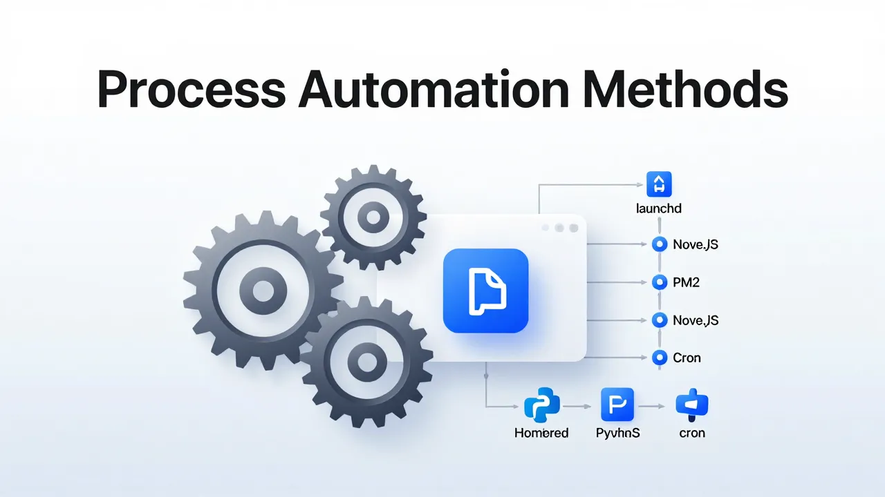

# macOS プロセス自動化手法の概要



macOS は、プロセスの自動化とサービス管理のための複数のアプローチを提供しており、それぞれが異なるシナリオに適しています。ネイティブの launchd システムから PM2 のような言語固有のプロセスマネージャーまで、macOS でバックグラウンドサービス、スケジュールタスク、本番アプリケーションを実行するには、これらのツールを理解することが不可欠です。

## はじめに

macOS でのプロセス自動化は、単なるスクリプト以上のものです。サービスの存続、タスクのスケジューリング、ユーザーセッションに依存しないアプリケーションの管理が含まれます。Node.js API を実行する開発者、システムサービスを管理するシステム管理者、Python スクリプトをスケジュールするデータサイエンティストのいずれであっても、macOS はニーズに合わせたツールを提供しています。

このガイドでは、macOS の主要なプロセス自動化手法について解説します：

- **launchd** - macOS のネイティブ init システム
- **brew services** - シンプルな Homebrew サービス管理
- **PM2** - Node.js 本番用プロセスマネージャー
- **Supervisord/Circus** - Python プロセス制御
- **Overmind** - Procfile を使用した開発環境
- **cron** - レガシー Unix スケジューリング

## クイック比較表

| ツール | タイプ | ユースケース | 複雑さ |
|------|------|----------|------------|
| **launchd** | ネイティブシステム | 本番サービス、スケジュールタスク | 高 |
| **brew services** | ラッパー | Homebrew サービス | 低 |
| **PM2** | Node.js | Node.js 本番環境 | 中 |
| **Forever** | Node.js | シンプルな Node.js | 低 |
| **Supervisord** | Python | Python/任意の言語 | 中 |
| **Circus** | Python | モダンな Python | 中 |
| **Overmind** | Procfile | 開発 | 低 |
| **cron** | Unix スケジューラー | レガシータスク | 低 |

## ネイティブ macOS: launchd

### launchd とは何か

launchd は macOS の init システムおよびサービスマネージャーであり、Linux の systemd に相当します。Mac OS X 10.4 (Tiger) で導入され、デーモン、エージェント、スケジュールタスクを管理します。macOS 上のすべてのプロセス（カーネルを除く）は、最終的には launchd の子プロセスです。

**主要コンポーネント:**

- **launchd** - システムサービスマネージャー
- **launchctl** - サービス管理用のコマンドラインインターフェース
- **LaunchAgents** - ユーザーレベルサービス（ユーザーログイン時に実行）
- **LaunchDaemons** - システムレベルサービス（ブート時に root として実行）

### launchctl コマンドリファレンス

```bash
# 読み込み済みのすべてのサービスを一覧表示
launchctl list

# サービスをロード
launchctl load ~/Library/LaunchAgents/com.example.service.plist

# サービスをアンロード
launchctl unload ~/Library/LaunchAgents/com.example.service.plist

# サービスを開始
launchctl start com.example.service

# サービスを停止
launchctl stop com.example.service

# サービスログを表示
log stream --predicate 'process == "your-process-name"' --level debug
```

### LaunchAgents と LaunchDaemons の違い

LaunchAgents と LaunchDaemons の区別は基本的です：

| 側面 | LaunchAgents | LaunchDaemons |
|--------|--------------|---------------|
| **実行タイミング** | ユーザーログイン時 | システムブート時 |
| **実行ユーザー** | ログインユーザー | root/システム |
| **権限** | ユーザーレベル | システムレベル |
| **GUI アクセス** | 可能 | 不可 |
| **場所** | `~/Library/LaunchAgents/` または `/Library/LaunchAgents/` | `/Library/LaunchDaemons/` |

**LaunchAgents** は GUI アクセスが必要なユーザー固有のタスク用です：
- メニューバーアプリ
- ユーザー自動化スクリプト
- ユーザー単位のバックグラウンドサービス

**LaunchDaemons** は、ユーザーに関係なく実行するシステムサービス用です：
- データベースサーバー
- Web サーバー
- システム監視ツール

### plist ファイルの作成

サービスは XML プロパティリスト (plist) ファイルで定義されます：

```xml
<?xml version="1.0" encoding="UTF-8"?>
<!DOCTYPE plist PUBLIC "-//Apple//DTD PLIST 1.0//EN" "http://www.apple.com/DTDs/PropertyList-1.0.dtd">
<plist version="1.0">
<dict>
    <key>Label</key>
    <string>com.example.myapp</string>

    <key>ProgramArguments</key>
    <array>
        <string>/usr/local/bin/node</string>
        <string>/Users/user/myapp/app.js</string>
    </array>

    <key>RunAtLoad</key>
    <true/>

    <key>KeepAlive</key>
    <true/>

    <key>WorkingDirectory</key>
    <string>/Users/user/myapp</string>

    <key>StandardOutPath</key>
    <string>/Users/user/myapp/logs/stdout.log</string>

    <key>StandardErrorPath</key>
    <string>/Users/user/myapp/logs/stderr.log</string>

    <key>EnvironmentVariables</key>
    <dict>
        <key>NODE_ENV</key>
        <string>production</string>
    </dict>
</dict>
</plist>
```

**主要な plist キー:**
- `Label` - 一意のサービス識別子（必須）
- `ProgramArguments` - 実行するコマンドと引数
- `RunAtLoad` - ロード時に直ちに開始
- `KeepAlive` - プロセス終了時に再起動
- `WorkingDirectory` - 作業ディレクトリを設定
- `StandardOutPath` / `StandardErrorPath` - ログファイルの場所
- `EnvironmentVariables` - プロセスの環境変数
- `StartInterval` - 指定した間隔で実行（スケジュールタスク用）
- `CalendarInterval` - 指定した時刻で実行（cron の代替スケジューリング）

### launchd によるスケジュールタスク

launchd は、macOS では cron に代わってスケジュールタスクを管理するようになりました。cron 構文の代わりに、カレンダー間隔を使用します：

```xml
<key>StartCalendarInterval</key>
<dict>
    <key>Hour</key>
    <integer>2</integer>
    <key>Minute</key>
    <integer>0</integer>
</dict>
```

これは毎日午前 2 時にタスクを実行します。その他の例：

```xml
<!-- 毎時 -->
<key>StartInterval</key>
<integer>3600</integer>

<!-- 毎週月曜の午前 9 時 -->
<key>StartCalendarInterval</key>
<dict>
    <key>Weekday</key>
    <integer>1</integer>
    <key>Hour</key>
    <integer>9</integer>
    <key>Minute</key>
    <integer>0</integer>
</dict>

<!-- 毎月1日の午前 3 時 -->
<key>StartCalendarInterval</key>
<dict>
    <key>Day</key>
    <integer>1</integer>
    <key>Hour</key>
    <integer>3</integer>
    <key>Minute</key>
    <integer>0</integer>
</dict>
```

### launchd サービスのデバッグ

サービスが開始できない場合：

1. **構文を確認:**
```bash
plutil -lint ~/Library/LaunchAgents/com.example.service.plist
```

2. **システムログを表示:**
```bash
log show --predicate 'process == "launchd"' --last 1h
log stream --predicate 'eventMessage contains "com.example"'
```

3. **サービスステータスを確認:**
```bash
launchctl list | grep com.example
```

4. **テスト用の手動実行:**
```bash
# エラーを確認するためにコマンドを直接実行
/usr/local/bin/node /Users/user/myapp/app.js
```

**参考資料:** [Understanding macOS LaunchAgents and Login Items](https://medium.com/@durgaviswanadh/understanding-macos-launchagents-and-login-items-a-clear-practical-guide-5c0e39e3a6b3)、[What are launchd agents and daemons on macOS?](https://victoronsoftware.com/posts/macos-launchd-agents-and-daemons/)

## スケジューリング: launchd vs cron

### cron の非推奨ステータス

Apple は cron を非推奨とし、代わりに launchd を推奨していますが、下位互換性のために cron はまだサポートされています。macOS Sequoia では、Apple は System Settings にレガシー cron サポートのフラグを追加しました。

### launchd スケジューリングを使用すべき場合

launchd は cron に対して有利な点があります：

- **更好的な統合** - ネイティブ macOS サービス管理
- **多くのトリガー** - ファイル監視、システムイベントなど、時間だけではない
- **スリープ処理** - スリープ/ウェイクサイクルをインテリジェントに処理
- **セキュリティコンテキスト** - 適切な macOS 権限で実行
- **ロギング** - Unified Logging と統合

### crontab から launchd への移行

**crontab エントリー:**
```cron
0 2 * * * /Users/user/scripts/backup.sh
```

**同等の launchd plist:**
```xml
<key>Label</key>
<string>com.user.backup</string>

<key>ProgramArguments</key>
<array>
    <string>/Users/user/scripts/backup.sh</string>
</array>

<key>StartCalendarInterval</key>
<dict>
    <key>Hour</key>
    <integer>2</integer>
    <key>Minute</key>
    <integer>0</integer>
</dict>
```

### cron がまだ有効な場合

cron 構文に既に慣れているシンプルな時間ベースのタスクの場合：

```bash
# crontab を編集
crontab -e

# crontab を一覧表示
crontab -l

# crontab を削除
crontab -r
```

**参考資料:** [Scheduled jobs with launchd rather than cron](https://www.jeremycherfas.net/blog/scheduled-jobs-with-launchd-rather-than-cron)、[Use launchd instead of crontab on your Mac](https://bas-man.dev/post/launchd-instead-of-cron/)

## Homebrew Services

### インストール

まず、Homebrew をインストールしていない場合はインストールします：

```bash
/bin/bash -c "$(curl -fsSL https://raw.githubusercontent.com/Homebrew/install/HEAD/install.sh)"
```

その後、インストールを確認します：

```bash
brew --version
```

### brew services とは何か

`brew services` は、バックグラウンドサービスの管理を簡素化する Homebrew 拡張機能です。Homebrew 経由でインストールされたサービスに使い慣れたインターフェースを提供するために launchd をラップしています。

```bash
# すべてのサービスを一覧表示
brew services list

# サービスを開始
brew services start postgresql

# サービスを停止
brew services stop redis

# サービスを再起動
brew services restart nginx

# フォアグラウンドでサービスを実行（デバッグ用）
brew services run postgresql
```

### brew services が launchd を使用する方法

brew services は自動的に launchd plist ファイルを作成します：

- **ユーザーサービス** → `~/Library/LaunchAgents/`
- **システムサービス** → `/Library/LaunchDaemons/`

例えば、`brew services start postgresql` は `~/Library/LaunchAgents/homebrew.mxcl.postgresql.plist` に plist を作成します。

### 一般的なユースケース

**データベース:**
```bash
brew install postgresql
brew services start postgresql

brew install mysql
brew services start mysql

brew install redis
brew services start redis
```

**Web サーバー:**
```bash
brew install nginx
brew services start nginx
```

**開発スタック:**
```bash
# 複数のサービスを開始
brew services start postgresql
brew services start redis
brew services start memcached
```

### GUI ツール

グラフィカルインターフェースを好むユーザー向け：

- **[BrewServicesManager](https://github.com/validatedev/BrewServicesManager)** - Homebrew サービス管理用メニューバーアプリ
- **[brew-services-manage](https://github.com/persiliao/brew-services-manage)** - ログアクセス付きサービス管理

**参考資料:** [Homebrew Services: How to Use, How It Works](https://dorokhovich.com/blog/homebrew-services)、[Managing background processes in Ventura](https://thoughtbot.com/blog/as-managing-background-processes-in-ventura)

## Node.js プロセスマネージャー

### PM2

PM2 は、本番環境での Node.js プロセス管理の事実上の標準です。クラスタリング、監視、自動再起動機能を提供します。

**インストール:**
```bash
npm install pm2 -g
```

**基本コマンド:**
```bash
# アプリケーションを開始
pm2 start app.js

# 名前を指定して開始
pm2 start app.js --name "api"

# 複数のインスタンスを開始（クラスターモード）
pm2 start app.js -i max

# すべてのプロセスを一覧表示
pm2 list

# ログを表示
pm2 logs

# 監視ダッシュボード
pm2 monit

# プロセスを停止
pm2 stop api

# プロセスを再起動
pm2 restart api

# プロセスを削除
pm2 delete api
```

**PM2 の macOS 起動設定（launchd 統合）**

ブート時に PM2 が自動的に開始するようにするには：

```bash
# 起動スクリプトを生成して保存
pm2 startup darwin

# 現在のプロセスリストを保存
pm2 save

# ここでアプリを開始
pm2 start app.js
pm2 save
```

`pm2 startup darwin` コマンドは、システムブート時に PM2 をロードする launchd plist を生成し、`pm2 save` は現在のプロセスリストを永続化して、PM2 が再起動後にアプリケーションを復元できるようにします。

**参考資料:** [PM2 Documentation](https://pm2.io/docs/runtime/guide/installation/)、[How to use pm2 startup command on macOS](https://stackoverflow.com/questions/26664282/how-to-use-pm2-startup-command-on-mac)

### Forever

よりシンプルなユースケースでは、Forever は基本的な存続機能を提供します：

```bash
npm install forever -g

# スクリプトを開始
forever start app.js

# 実行中のスクリプトを一覧表示
forever list

# スクリプトを停止
forever stop app.js
```

**最適用途:** 開発環境、シンプルなスクリプト、PM2 の機能が不要な場合。

**参考資料:** [Running Node.js scripts continuously using forever](https://blog.logrocket.com/running-node-js-scripts-continuously-forever/)

### その他の Node.js オプション

- **nodemon** - ファイル変更時に自動再起動（開発専用）
  ```bash
  npm install -g nodemon
  nodemon app.js
  ```
- **concurrently** - 複数の npm スクリプトを同時に実行
  ```bash
  npm install -g concurrently
  concurrently "npm run watch" "npm run serve"
  ```
- **nohup** - クィックバックグラウンドタスク用の組み込み Unix コマンド

## Python プロセスマネージャー

### Supervisord

Supervisord は Unix 系システム用の成熟したプロセス制御システムで、Python 環境で広く使用されています。

**インストール:**
```bash
brew install supervisord
# または pip 経由：
pip install supervisor
```

**設定 (`/etc/supervisord.conf` または `~/.supervisor/supervisord.conf`):**
```ini
[supervisord]
nodaemon=false
logfile=/var/log/supervisor/supervisord.log

[program:myapp]
command=/usr/bin/python3 /path/to/app.py
directory=/path/to/app
user=myuser
autostart=true
autorestart=true
stderr_logfile=/var/log/supervisor/myapp.err.log
stdout_logfile=/var/log/supervisor/myapp.out.log
```

**コマンド:**
```bash
# supervisord を開始
supervisord -c /path/to/supervisord.conf

# ステータスを確認
supervisorctl status

# プログラムを開始
supervisorctl start myapp

# プログラムを停止
supervisorctl stop myapp

# プログラムを再起動
supervisorctl restart myapp

# 設定を再読み込み
supervisorctl reread
supervisorctl update
```

**参考資料:** [Supervisor Official Documentation](https://supervisord.org/)、[Install supervisor on Mac M1](https://medium.com/@rachaelnantale42/install-supervisor-on-mac-m1-bf36b71b56ea)

### Circus

Circus は、Supervisord のモダンな Python ベースの代替手段で、より良いパフォーマンスと活発な開発があります：

```bash
pip install circus
```

**Circus 設定 (`circus.ini`):**
```ini
[watcher:myapp]
cmd = python3 /path/to/app.py
uid = myuser
numprocesses = 1
autostart = true
stop_signal = TERM
```

**コマンド:**
```bash
circusd circus.ini
circusctl status
circusctl start myapp
circusctl stop myapp
```

**Supervisord に対する利点:**
- ZeroMQ による更好的なパフォーマンス
- プロセス変更に素早く応答
- 活発な開発
- クロスプラットフォーム

**参考資料:** [Circus Documentation](https://circus.readthedocs.io/)

## Procfile ベースのマネージャー

### Overmind

Overmind は tmux を使用したモダンなプロセスマネージャーで、複数のプロセスを持つ開発環境に最適です。

**インストール:**
```bash
brew install overmind
```

**Procfile (`Procfile`):**
```
web: bundle exec rails server
worker: bundle exec sidekiq
redis: redis-server
```

**使用方法:**
```bash
overmind start
```

Overmind は各プロセスを独自のウィンドウで tmux セッションを作成し、標準的な tmux コマンドでアクセスできます。

**最適用途:** 開発環境、マルチプロセスアプリケーション、ターミナルベースのワークフロー。

**参考資料:** [Overmind GitHub](https://github.com/DarthSim/overmind)、[Control Your Dev Processes with Overmind](https://pragmaticpineapple.com/control-your-dev-processes-with-overmind/)

### Honcho (Python) と Foreman (Ruby)

**Honcho (Python):**
```bash
pip install honcho
honcho start
```

**Foreman (Ruby):**
```bash
gem install foreman
foreman start
```

両方とも Overmind と同じ Procfile 形式をサポートしますが、tmux TUI はありません。

## その他の手法

### nohup

クイックバックグラウンドタスク用：

```bash
nohup node app.js &
```

**最適用途:** クイックテスト、シンプルなバックグラウンドタスク、一時的な実行。

### screen/tmux

永続的なターミナルセッション用：

```bash
screen -S mysession
# または
tmux new -s mysession
```

**最適用途:** インタラクティブセッション、リモートワーク、長時間実行するターミナルプロセス。

## 総合的な比較: 長所と短所

| ツール | 説明 | 長所 | 短所 |
|------|-------------|------|------|
| **launchd** | macOS ネイティブ init システム | ✅ macOS ネイティブ<br>✅ インストール不要<br>✅ システム更新後に残る<br>✅ 最も信頼性が高い<br>✅ 完全なシステム統合 | ❌ XML 設定は冗長<br>❌ 学習曲線が急<br>❌ デバッグが困難<br>❌ コミュニティツールが限定的 |
| **brew services** | Homebrew サービスラッパー | ✅ 非常にシンプルなインターフェース<br>✅ ワンコマンドインストール<br>✅ Homebrew ユーザーに馴染みやすい<br>✅ plist を自動生成 | ❌ Homebrew が必要<br>❌ カスタマイズが限定的<br>❌ 本番環境には不向き<br>❌ 隠れた複雑さ |
| **PM2** | Node.js プロセスマネージャー | ✅ Node.js 向けに設計<br>✅ クラスタリングサポート<br>✅ 優秀な監視機能<br>✅ クラッシュ時自動再起動<br>✅ ゼローダウンタイム再起動 | ❌ Node.js 専用<br>❌ 追加のソフトウェア依存<br>❌ メモリーオーバーヘッド<br>❌ 機能学習曲線 |
| **Forever** | シンプルな Node.js 存続機能 | ✅ 非常に軽量<br>✅ シンプルで使いやすい<br>✅ リソース使用量が低い | ❌ 最小限の機能<br>❌ 監視ダッシュボードなし<br>❌ クラスタリングなし<br>❌ 手動再起動のみ |
| **Supervisord** | Python プロセスマネージャー | ✅ 成熟して安定<br>✅ 言語に依存しない<br>✅ Web 監視インターフェース<br>✅ プロセスグルーピング | ❌ 古いアーキテクチャ<br>❌ 設定の複雑さ<br>❌ モダンな代替手段より低速<br>❌ 開発があまり活発でない |
| **Circus** | モダンな Python プロセスマネージャー | ✅ より良いパフォーマンス<br>✅ 通信に ZeroMQ<br>✅ 活発な開発<br>✅ クロスプラットフォーム | ❌ コミュニティが小さい<br>❌ Supervisord ほど成熟していない<br>❌ 異なる設定形式<br>❌ チュートリアルが少ない |
| **Overmind** | Procfile ベースの開発マネージャー | ✅ tmux による優れた TUI<br>✅ 標準的な Procfile 形式<br>✅ 開発に最適<br>✅ 視覚的なプロセス制御 | ❌ tmux 依存<br>❌ 本番環境には不向き<br>❌ ターミナルアクセスが必要<br>❌ macOS 固有の癖 |
| **Honcho** | Python Procfile マネージャー | ✅ クロスプラットフォーム<br>✅ シンプルなインターフェース<br>✅ 純粋な Python | ❌ TUI なし<br>❌ Overmind ほど普及していない<br>❌ 最小限の機能 |
| **Foreman** | Ruby Procfile マネージャー | ✅ オリジナルの Procfile ツール<br>✅ 実績あり<br>✅ 大規模なコミュニティ | ❌ Ruby 依存<br>❌ 古いコードベース<br>❌ TUI なし<br>❌ 代替手段より低速 |
| **cron** | Unix ジョブスケジューラー | ✅ お馴染みの構文<br>✅ クイックタスクにシンプル<br>✅ どこでも動作 (Unix) | ❌ macOS では非推奨<br>❌ ネイティブ macOS 統合なし<br>❌ エラー処理が貧弱<br>❌ スリープ/ウェイクをうまく処理しない |
| **nohup** | Unix バックグラウンドコマンド | ✅ Unix に組み込み<br>✅ インストール不要<br>✅ テストにクイック | ❌ 自動再起動なし<br>❌ 監視なし<br>❌ 端末終了時に失われる<br>❌ 手動プロセス管理のみ |
| **screen/tmux** | ターミナルマルチプレクサー | ✅ 永続的なセッション<br>✅ リモートワークに最適<br>✅ 複数のウィンドウ | ❌ 自動化には不向き<br>❌ ターミナルアクセスが必要<br>❌ 手動プロセス管理<br>❌ セッションベース（サービスではない） |

## 決定フレームワーク

### ユースケースによる選択

| シナリオ | 推奨ツール | 理由 |
|----------|------------------|-----|
| 本番システムサービス | launchd | ネイティブ、信頼性、再起動後に残る |
| Procfile による開発 | Overmind | TUI、簡単なプロセス管理 |
| Node.js 本番環境 | PM2 | クラスタリング、監視、自動再起動 |
| Node.js シンプル/開発 | Forever | シンプル、軽量 |
| Python 本番環境 | Circus/Supervisord | Python ネイティブ、成熟 |
| データベース/Redis | brew services | シンプル、Homebrew 統合 |
| 一回限りのバックグラウンドタスク | nohup | 組み込み、セットアップ不要 |
| 本番スケジュールタスク | launchd | ネイティブ、より多くの機能 |
| クロスプラットフォーム開発 | Honcho | どこでも動作 |

### スキルレベルによる選択

| ユーザープロフィール | 最初にこれから | 次に展開 |
|--------------|------------|----------|
| macOS ネイティブ重視 | launchd | brew services |
| Node.js 開発者 | PM2 | システム統合のために launchd |
| Python 開発者 | Circus | データベース用に brew services |
| DevOps エンジニア | launchd | Supervisord/Circus |
| 初心者 | brew services | PM2 または launchd |
| パワーユーザー | Overmind | 必要に応じてすべてのツール |

### 統合ストラテジ

**PM2 と launchd の統合:**
```bash
pm2 startup darwin  # launchd plist を作成
pm2 save           # 現在のプロセスリストを保存
```

**brew services と launchd の統合:**
brew services は自動的に launchd plist を作成します。

**Overmind と Docker の統合:**
ローカルプロセスには Overmind、コンテナには Docker、スクリプトで調整します。

## 結論

macOS はプロセス自動化のための豊富なツールキットを提供しています：

1. **ほとんどのユーザー向け**: シンプルさのために `brew services` から始める
2. **本番環境向け**: `launchd` を直接使用するか、ツール統合（PM2 startup）を通じて使用
3. **Node.js 向け**: PM2 が業界標準
4. **Python 向け**: Supervisord または Circus
5. **開発向け**: Overmind が優れたワークフローを提供

重要なのは、特定のユースケースと環境に適したツールを選択することです。launchd のようなネイティブツールは macOS との最も信頼性の高い統合を提供し、PM2 のような言語固有のツールはそのエコシステム向けの専門機能を提供します。

---

**カバー画像:** launchd アーキテクチャ、brew services インターフェース、PM2 ダッシュボード、比較表を含む macOS 自動化ツールの技術図。

**参考資料:**
- [Understanding macOS LaunchAgents](https://medium.com/@durgaviswanadh/understanding-macos-launchagents-and-login-items-a-clear-practical-guide-5c0e39e3a6b3)
- [Homebrew Services Guide](https://dorokhovich.com/blog/homebrew-services)
- [PM2 Documentation](https://pm2.io/docs/runtime/guide/installation/)
- [Supervisor Documentation](https://supervisord.org/)
- [Overmind GitHub](https://github.com/DarthSim/overmind)
